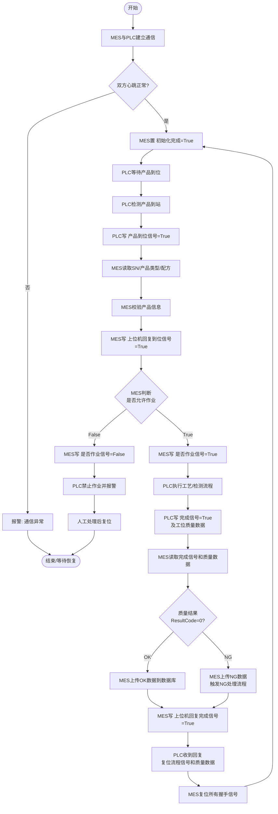

# MES↔PLC 交互流程说明

**文档编号：** MES-PLC-FLOW-V1.0  
**版本：** V1.0  
**日期：** 2026-05-05  
**配套文档：** [MES_PLC_Map_V1.0.md](MES_PLC_Map_V1.0.md)

---

## 目录

1. [总体交互架构](#1-总体交互架构)
2. [心跳与通信监控](#2-心跳与通信监控)
3. [初始化流程](#3-初始化流程)
4. [产品到位握手流程](#4-产品到位握手流程)
5. [作业许可与完成握手流程](#5-作业许可与完成握手流程)
6. [多工位扩展流程](#6-多工位扩展流程)
7. [复位规则](#7-复位规则)
8. [超时处理机制](#8-超时处理机制)
9. [质量数据处理](#9-质量数据处理)
10. [异常处理流程](#10-异常处理流程)
11. [完整时序图](#11-完整时序图)
12. [主流程图](#12-主流程图)

---

## 1. 总体交互架构

MES上位机（MASTER）与 PLC 通过 Siemens S7 DB块进行数据交互，采用双向握手协议：

```
┌─────────────────────────────────────────────────────────────┐
│                    通信架构概览                               │
│                                                             │
│   MES上位机 (MASTER)         PLC 下位机                     │
│   ┌───────────────┐         ┌───────────────┐               │
│   │               │──写──→  │  DB201        │               │
│   │  MASTER 程序  │  DB201  │ (MASTER→PLC)  │               │
│   │               │         │               │               │
│   │               │←─读──  │  DB200        │               │
│   │               │  DB200  │ (PLC→MASTER)  │               │
│   └───────────────┘         └───────────────┘               │
│                                                             │
│   通信协议：Siemens S7 TCP/IP（或 OPC-UA / Modbus TCP）     │
│   通信周期：建议 ≤ 100ms 轮询                                │
└─────────────────────────────────────────────────────────────┘
```

**关键地址对照：**

| 方向 | DB块 | 核心信号 |
|---|---|---|
| MASTER → PLC | DB201 | 心跳、初始化完成、回复到位、是否作业、回复完成、SN、产品类型 |
| PLC → MASTER | DB200 | 心跳、产品到位、完成信号、质量数据（推荐） |

---

## 2. 心跳与通信监控

### 2.1 心跳机制说明

双方各自维护一个心跳位，以检测通信连接是否正常：

| 信号 | 地址 | 所属方 | 更新周期 | 超时阈值 |
|---|---|---|---|---|
| MES心跳 | DB201.DBX0.0 | MASTER | 每1秒翻转/复位 | 超过10秒无变化 → PLC报警 |
| PLC心跳 | DB200.DBX0.0（推荐） | PLC | 每1秒翻转/复位 | 超过10秒无变化 → MES报警 |

### 2.2 心跳时序图

```
MES上位机                         PLC
    │                               │
    │──── DB201.DBX0.0 = 1 ────→   │  t=0s
    │                               │
    │──── DB201.DBX0.0 = 0 ────→   │  t=1s
    │                               │
    │──── DB201.DBX0.0 = 1 ────→   │  t=2s
    │         ...                   │
    │         (正常通信)             │
    │                               │
    │   [MES程序异常/网络中断]       │
    │                               │
    │         (超过10秒无更新)       │
    │                               │
    │                      ┌────────┤
    │                      │ PLC报警 │
    │                      │ 通信异常 │
    │                      └────────┤
```

### 2.3 心跳异常处理

```
检测到心跳超时（>10秒无变化）
        │
        ▼
  触发通信异常报警
        │
        ▼
  PLC停止当前流程（安全状态）
        │
        ▼
  等待心跳恢复
        │
        ├─ 恢复 → 清除报警 → 等待MES重新初始化
        │
        └─ 持续异常 → 通知现场人员处理
```

---

## 3. 初始化流程

MES 系统启动或每次流程结束后，需完成初始化确认：

```
MES上位机                         PLC
    │                               │
    │  [MES系统启动/流程完成后]      │
    │                               │
    │  内部检查：                    │
    │  - 网络连接正常                │
    │  - 工单/配方已加载             │
    │  - 质量系统连接正常            │
    │                               │
    │──── DB201.DBX0.1 = True ──→  │  初始化完成信号
    │                               │
    │                    [PLC检测]  │
    │                    初始化完成 = True
    │                               │
    │                    允许进入   │
    │                    自动流程模式│
```

**初始化完成条件（MES侧）：**
- MES与数据库连接正常
- 当前工单/配方已正确加载
- 设备通信心跳正常
- 上一个流程已完整结束（所有握手位已复位）

---

## 4. 产品到位握手流程

### 4.1 流程描述

```
MES上位机                         PLC
    │                               │
    │                   [产品到达]  │
    │                   传感器检测  │
    │                   产品到位    │
    │                               │
    │                   ┌──────────┤
    │                   │扫码读SN   │
    │                   └──────────┤
    │                               │
    │   ←── DB200.DBX0.1 = True ───│  产品到位信号
    │                               │
    │  [MES收到到位信号]             │
    │  读取：DB201.DBB4（产品类型）  │
    │  读取：DB201.DBB6~45（SN）    │
    │  （或读DB200中PLC上报的SN）    │
    │                               │
    │  内部处理：                    │
    │  - 核对SN是否在工单中          │
    │  - 核对产品类型/配方           │
    │  - 判断是否允许作业            │
    │  - 判断是否返修/转线           │
    │                               │
    │──── DB201.DBX0.2 = True ──→  │  上位机回复到位信号
    │──── DB201.DBX0.3 = True/False→│  是否作业信号
    │──── DB201.DBB4   = 配方号 ──→ │  产品类型/配方
    │──── DB201.DBB6~45 = SN ────→ │  产品条码
```

### 4.2 产品到位握手状态机

```
┌─────────┐    产品到站     ┌──────────────┐
│  待机   │ ─────────────→ │  等待MES确认  │
│ (空闲)  │                └──────────────┘
└─────────┘                        │
                        MES回复到位信号=True
                                   │
                    ┌──────────────▼──────────────┐
                    │      读取是否作业信号          │
                    └─────────────────────────────┘
                           /                \
                  True=可作业          False=不可作业
                      /                        \
           ┌──────────▼─────┐        ┌──────────▼──────┐
           │  进入作业流程   │        │  禁止作业/报警   │
           └────────────────┘        └─────────────────┘
```

---

## 5. 作业许可与完成握手流程

### 5.1 完整握手时序图

```
MES上位机                                    PLC
    │                                          │
    │  ←────── 产品到位信号=True ──────────────│
    │                                          │
    │  ──────── 回复到位信号=True ────────────→│
    │  ──────── 是否作业信号=True ────────────→│
    │                                          │
    │                            [PLC执行]     │
    │                            工艺/检测流程  │
    │                                          │
    │  ←────── 完成信号=True ─────────────────│
    │  ←────── 工位质量数据（写入DB） ─────────│
    │                                          │
    │  [MES处理]                               │
    │  读取质量数据                             │
    │  判断OK/NG                               │
    │  上传数据库                              │
    │                                          │
    │  ──────── 回复完成信号=True ────────────→│
    │                                          │
    │                            [PLC复位]     │
    │                            完成信号=False│
    │                            质量数据清零   │
    │                            到位信号=False│
    │                                          │
    │  [MES复位]                               │
    │  回复到位信号=False                      │
    │  是否作业信号=False                      │
    │  回复完成信号=False                      │
    │                                          │
    │  ──────── 初始化完成=True ──────────────→│  准备下一循环
```

### 5.2 是否作业信号=False 的处理

```
MES上位机                                    PLC
    │                                          │
    │  ←────── 产品到位信号=True ──────────────│
    │                                          │
    │  ──────── 回复到位信号=True ────────────→│
    │  ──────── 是否作业信号=False ───────────→│
    │                                          │
    │                            [PLC响应]     │
    │                            禁止执行工艺   │
    │                            触发不可作业报警│
    │                            等待现场处理   │
    │                                          │
    │                            [人工干预后]  │
    │                            PLC复位到位信号│
    │                                          │
    │  [MES复位]                               │
    │  回复到位信号=False                      │
    │  是否作业信号=False                      │
```

---

## 6. 多工位扩展流程

当存在第二工位或第二流程时，使用Byte 1中的信号：

```
MES上位机                                    PLC（工位2）
    │                                          │
    │  ←──── 产品到位信号2=True（DB200.DBX1.0）│
    │                                          │
    │  ───── 回复到位信号2=True（DB201.DBX1.0）→│
    │  ───── 是否作业信号2=True（DB201.DBX1.1）→│
    │                                          │
    │                            [工位2执行]   │
    │                                          │
    │  ←──── 完成信号2=True（DB200.DBX1.1）────│
    │  ←──── 工位2质量数据（DB200.DBB76~95）───│
    │                                          │
    │  ───── 回复完成信号2=True（DB201.DBX1.2）→│
    │                                          │
    │                            [工位2复位]   │
```

**注意：** 工位1和工位2可以并行运行，MES需分别维护两个握手状态机。

---

## 7. 复位规则

### 7.1 信号复位责任表

| 信号 | 置位方 | 复位方 | 复位时机 |
|---|---|---|---|
| MES心跳（DB201.DBX0.0） | MASTER | MASTER | 每1秒自动翻转 |
| 初始化完成（DB201.DBX0.1） | MASTER | MASTER | 流程开始前重置，完成后重新置True |
| 上位机回复到位信号（DB201.DBX0.2） | MASTER | PLC | PLC收到后、或流程复位时由PLC触发MES复位 |
| 是否作业信号（DB201.DBX0.3） | MASTER | PLC | PLC收到后触发MES复位 |
| 上位机回复完成信号（DB201.DBX0.4） | MASTER | PLC | PLC收到后触发MES复位 |
| 产品到位信号（DB200.DBX0.1）（推荐） | PLC | MES | MES收到并回复后，PLC自行复位 |
| 完成信号（DB200.DBX0.2）（推荐） | PLC | PLC | PLC收到MES回复完成信号后自行复位 |
| 工位质量数据 | PLC | PLC | 流程结束后PLC主动清零 |
| SN（DB201.DBB6~45） | MASTER | PLC | 产品离站后PLC触发MES清空 |

### 7.2 复位顺序

```
流程结束触发
    │
    ▼
1. PLC 复位：完成信号
2. PLC 写入质量数据（已完成）
3. MES 读取质量数据并处理
4. MES 写入：回复完成信号=True
5. PLC 收到回复完成信号
6. PLC 复位：产品到位信号、质量数据清零
7. MES 复位：回复到位信号、是否作业信号、回复完成信号
8. PLC 复位：到位信号（确认MES已复位）
9. 双方就绪 → MES写 初始化完成=True → 等待下一产品
```

---

## 8. 超时处理机制

| 超时场景 | 超时阈值 | 处理方式 |
|---|---|---|
| 心跳超时 | >10秒无变化 | 对方触发通信异常报警，停止流程 |
| MES未收到产品到位信号 | — | PLC持续发送直到MES应答 |
| MES回复到位信号超时 | 建议 ≤ 5秒 | PLC触发"等待MES超时"报警 |
| PLC未执行完成信号超时 | 视工艺而定（如60秒） | MES触发"PLC完成超时"报警 |
| MES回复完成信号超时 | 建议 ≤ 5秒 | PLC触发"等待MES回复超时"报警 |
| 质量数据读取超时 | 建议 ≤ 3秒 | MES重试，失败后记录异常 |

### 8.1 超时处理流程图

```
[信号等待]
    │
    ├─ 在超时阈值内收到信号 → 正常处理
    │
    └─ 超过超时阈值未收到
            │
            ▼
        [触发超时报警]
            │
            ▼
        [记录超时事件到日志]
            │
            ▼
        [通知现场操作人员]
            │
            ├─ 人工确认重试 → 复位握手信号 → 重新执行
            │
            └─ 确认设备/系统故障 → 进入异常停线处理
```

---

## 9. 质量数据处理

### 9.1 质量数据结构（每组20字节）

| 偏移 | 长度(Byte) | 数据类型 | 字段名 | 说明 |
|:---:|:---:|---|---|---|
| 0 | 2 | WORD | ResultCode | 质量结果码（0=OK，非0=NG） |
| 2 | 4 | REAL | 工艺值1 | 实际检测值1（如扭矩 Nm） |
| 6 | 4 | REAL | 工艺值2 | 实际检测值2（如角度 °） |
| 10 | 4 | REAL | 工艺值3 | 实际检测值3（如时间 s） |
| 14 | 2 | WORD | ErrorCode | 错误代码（0=无错误） |
| 16 | 4 | BYTE×4 | 预留 | 预留字节 |

### 9.2 质量数据地址计算

- **工位N质量数据起始地址：** `Byte = 56 + (N - 1) × 20`（N=1~10）
- **最多支持：** 10个工位，共200字节（Byte 56 ~ Byte 255）

| 工位 | 起始地址 | 结束地址 |
|:---:|:---:|:---:|
| 工位1 | Byte 56 | Byte 75 |
| 工位2 | Byte 76 | Byte 95 |
| 工位3 | Byte 96 | Byte 115 |
| 工位4 | Byte 116 | Byte 135 |
| 工位5 | Byte 136 | Byte 155 |
| 工位6 | Byte 156 | Byte 175 |
| 工位7 | Byte 176 | Byte 195 |
| 工位8 | Byte 196 | Byte 215 |
| 工位9 | Byte 216 | Byte 235 |
| 工位10 | Byte 236 | Byte 255 |

### 9.3 质量数据处理流程

```
[PLC完成流程]
    │
    ▼
[PLC写入质量数据到DB]
    │
    ▼
[PLC置位 完成信号=True]
    │
    ▼
[MES检测到完成信号]
    │
    ▼
[MES读取工位质量数据块]
    │
    ▼
[MES解析ResultCode/工艺值/ErrorCode]
    │
    ├─ ResultCode = 0 → 判定为 OK → 上传数据库（含SN/工位/数值）
    │
    └─ ResultCode ≠ 0 → 判定为 NG → 上传NG记录 → 触发NG处理流程
    │
    ▼
[MES写入 回复完成信号=True]
    │
    ▼
[PLC收到回复 → 复位质量数据区（清零）]
```

---

## 10. 异常处理流程

### 10.1 不可作业处理

```
[MES判断不可作业的常见原因]
    ├─ SN未录入工单/批次
    ├─ 产品已完成该工序（防错）
    ├─ 产品被判定为NG（禁止流入下道工序）
    ├─ 当前配方与工单不匹配
    ├─ 返修工单未审批
    └─ MES系统异常

[处理流程]
    │
    ▼
MES写 是否作业信号=False
    │
    ▼
PLC禁止执行工艺动作
    │
    ▼
PLC触发"不可作业"提示/报警（HMI显示）
    │
    ▼
等待现场人员处理（人工移走产品或确认后放行）
    │
    ▼
PLC复位到位信号
    │
    ▼
MES复位回复到位信号、是否作业信号
```

### 10.2 通信恢复流程

```
[通信异常后恢复]
    │
    ▼
检测通信恢复（心跳重新更新）
    │
    ▼
MES复位所有握手信号
    │
    ▼
MES读取当前PLC状态
    │
    ├─ PLC处于空闲 → MES写 初始化完成=True → 正常流程
    │
    └─ PLC处于流程中 → 需人工确认当前产品状态 → 决定继续/复位
```

---

## 11. 完整时序图

```
MES上位机                                          PLC
    │                                               │
    │═══════════ 阶段A：初始化 ═══════════════════  │
    │                                               │
    │──── 心跳持续翻转 ────────────────────────────→│
    │←─── 心跳持续翻转 ─────────────────────────────│
    │──── 初始化完成=True ─────────────────────────→│
    │                                               │
    │═══════════ 阶段B：产品到位握手 ═══════════════│
    │                                               │
    │←─── 产品到位信号=True ────────────────────────│
    │   [读SN、校验、判断是否作业]                  │
    │──── 上位机回复到位信号=True ─────────────────→│
    │──── 是否作业信号=True ───────────────────────→│
    │──── SN / 产品类型 / 配方 ────────────────────→│
    │                                               │
    │═══════════ 阶段C：作业与完成握手 ═════════════│
    │                                               │
    │                              [PLC执行工艺]    │
    │←─── 完成信号=True + 质量数据 ─────────────────│
    │   [读质量数据、判OK/NG、上传DB]               │
    │──── 上位机回复完成信号=True ─────────────────→│
    │                                               │
    │═══════════ 阶段D：复位与准备下一循环 ══════════│
    │                                               │
    │                              [PLC复位信号]    │
    │   [MES复位握手位]                             │
    │──── 初始化完成=True ─────────────────────────→│
    │                                               │
    │══════════ 循环继续 ════════════════════════════│
```

---

## 12. 主流程图



---

## 变更记录

| 版本 | 日期 | 修改内容 | 修改人 |
|---|---|---|---|
| V1.0 | 2026-05-05 | 初版建立，含完整时序图、流程图和各阶段说明 | — |
